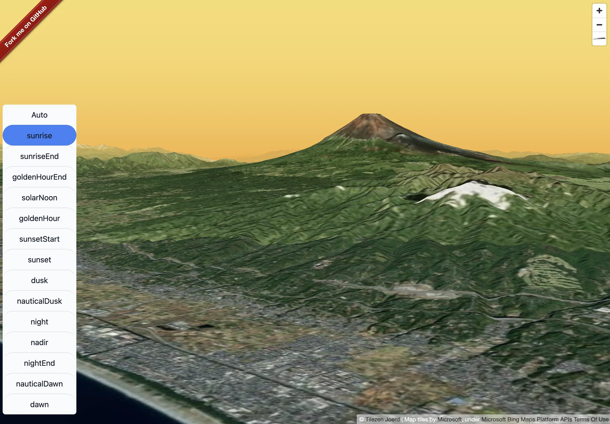

# malibre-gl-sky

This monorepo manages the source code for `@watergis/maplibre-gl-sky`.

## Repositories

| repository | version | description | changelog |
|---|---|---|---|
|[@watergis/maplibre-gl-sky](./packages/maplibre-gl-sky/)|  | To manage maplibre sky plugin source code|[CHANGELOG](./packages/maplibre-gl-sky/CHANGELOG.md)|
|[Demo & Documentation](./sites/demo/)| - | Demo website code for maplibre sky plugin |-|

## Contribution

See [CONTRIBUTING](./CONTRIBUTING.md)

## License

[MIT License](LICENSE)
