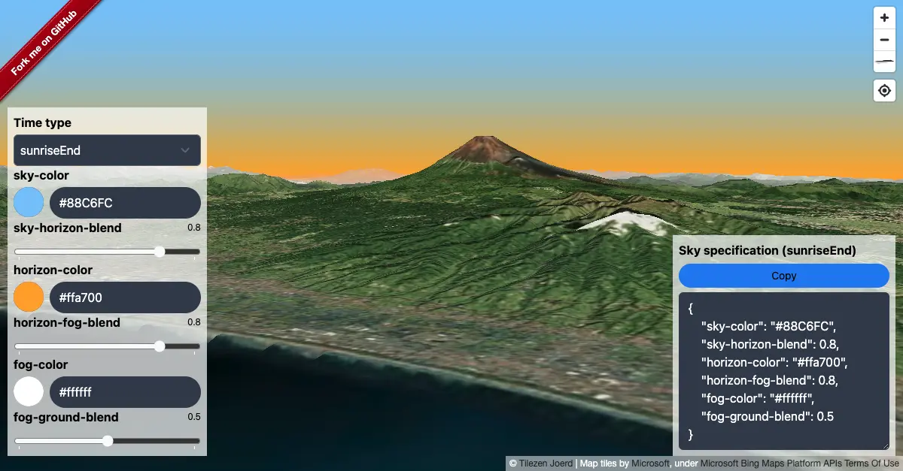

# malibre-gl-sky


[](https://github.com/watergis/maplibre-gl-sky/actions/workflows/ci.yml)


This repository is to add sky color to maplibre-gl-js smartly



## Installation

```shell
npm i -D @watergis/maplibre-gl-sky
```

## Usage

- Basic usage

This way, it will fetch the sun calc time from map center and try to get the right color palette for sky.

```ts
import maplibregl, { Map } from 'maplibre-gl';
import { SkyControl } from '@watergis/maplibre-gl-sky';

const map = new Map();

const sky = new SkyControl();
sky.addTo(map);
```

- add specific sky color

```ts
const sky = new SkyControl();
sky.addTo(map, {
	timeType: 'sunset'
});
```

- add specific date

```ts
const sky = new SkyControl();
sky.addTo(map, {
	date: new Date()
});
```

- Customise sky colors

```ts
import { defaultSkyOptions, SkyControl } from '@watergis/maplibre-gl-sky';

const newOptions = defaultSkyOptions;
// edit your options for `newOptions`

const sky = new SkyControl(newOptions);
sky.addTo(map);
```

## Contribution

See [CONTRIBUTING](./CONTRIBUTING.md)

## License

[MIT License](LICENSE)
